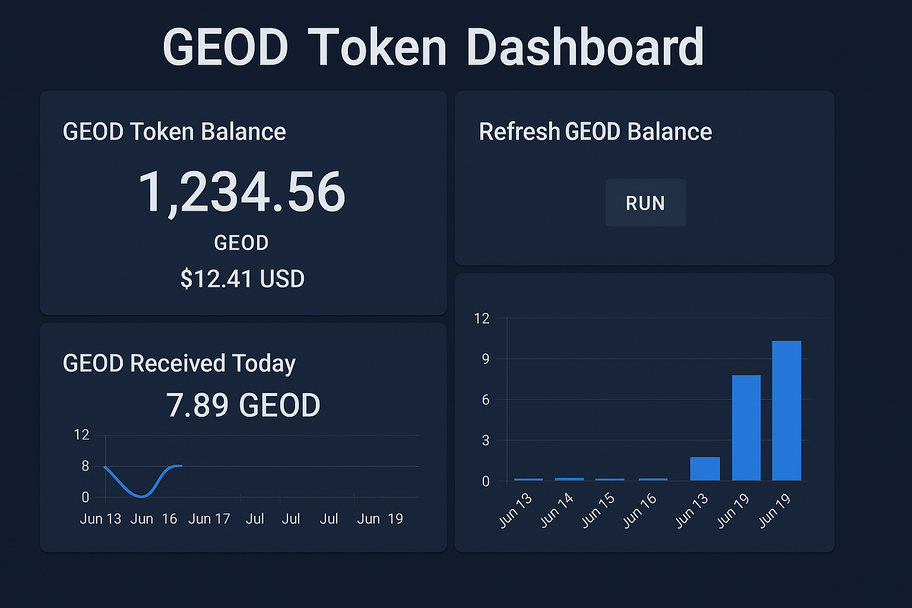

# GEOD Token Integration for Home Assistant

Track your GEOD token balance, price, USD value, and rewards in Home Assistant.

## Features
- 📦 Token balance from PolygonScan
- 🔁 Manual refresh via `geod.refresh_geod_data`
- 📋 UI-based config for wallet + API key
- 🛠️ HACS-compatible installation
